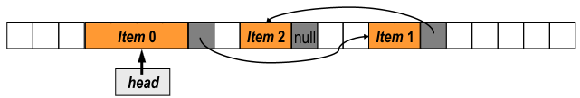

# Lists
#COMP2711 #DataStructures

- Sequences of elements (Stacks, Queues, Priority queues)
## Abstract Data Type (ADT)
$$ADT = \text{specification of a data set} + \text{operations on that data}$$
Data Structure = Implementation of an ADT in a programming language (OO languages - classes)
## Lists
### Operations
- Insert
- Locate
- Delete
- Print
- Previous
- Next
- First
- Last
The efficiency of these operations is dependant on the implementation used
*we use array-based and linked list implementations*
## Array Implementation of the ADT List
- 1D - sequence of items of the same data type
	- The items are stored contiguously in computer memory
	- The items can be accessed by specifying their indices
- Index will be between $0\text{ and }n-1$ or between $1 \text{ and } n$
- **Storage** Each element takes up the same amount of space
- **Access** Each element can be accesses in the same amount of time regardless of where it's stored
## Linked Implementation of the ADT List
- A sequence of elements called nodes. Each node contains two types of information.
	- Data
	- >1 links to other nodes in the linked list
- In a singly linked list, each node except for the last one, contains a single link to the next element (The last being NULL)
- In Computer Memory:
	- Don't need to be allocated contiguously
	- Order of items may differ from order stored in memory
	- The size of nodes can be different

## Comparisons of implementations
### Time complexity of operations
|  | Array Implementation | Linked Implementation |
| ---- | ---- | ---- |
| Insert | O(1) (last element) o(n) (element at index i) | O(1) (if a predecessor is located) |
| Delete | O(1) (last element) O(n) (element at index i) | O(1) (if a predecessor is located) |
| Locate | O(n) (unsorted list) O(log2n) (sorted list) | O(n) |
### When to use
| Array Implementation | Linked List implementation |
| ---- | ---- |
| A good choice for a list which size does not change substantially | A good choice for lists that grow/shrink |
| An element of an array with index i can be accessed directly | Accessing element i requires traversing from beginning |
| Uses an implicit ordering scheme (the item that follows A[i] is stored as A[i+1]) | Requires additional memory forreferences |
| Insertion or deletion is inefficient (shifting the remaining elements of the array) | Insertion or deletion is efficient, if theinsertion/deletion place is located |
| Efficient for search and retrieval | Inefficient for search and retrieval |
| Efficient for insertion and deletion at the end | Efficient for insertion and deletion at the front |
