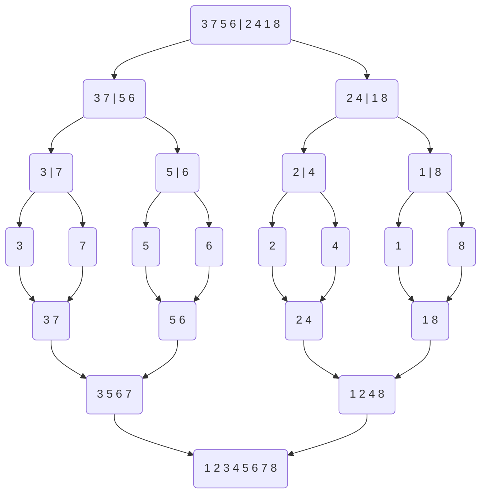

# Merge Sort
#COMP2711 #Sort
## The Process
- This is how the arrays are split however be careful as in code it will use recursion and will go back up the tree not down again
- In implementation the algorithm will do the left side as far down first before the right side so 7 3 5 6 will be completely sorted before 2 4 1 8 is touched

### Pseudo Code
```
ALGORITHM mergeSort(A[0..n-1])
//The algorithm sorts a given array by recursive
//merge sort
//Input: an array A[0..n-1] of n elements
//Output: array A[0..n-1] sorted in ascending order
if n > 1
	copy the first half of A to S1 //divide
	copy the second half of A to S2 //divide
	mergeSort(S1) //recur
	mergeSort(S2) //recur
	merge(S1,S2,A) //conquer

ALGORITHM merge(S1, S2, A[0..n-1])
count = 0
for i in S1 do
	if S1[i] <= S2[count]
		A <- S1[i]
	else 
		a <- S2[count]
		count <- count + 1
```

## Analysis
- At the leaves the arrays are of length one.
- Each time we go up a level in the tree, we are doubling the lengths of the arrays which can be sorted. 
- So if the tree is of depth $k$, then it can sort an array of length $2^k$ therefore $2^k = n$
- For two sub-arrays S1 and S2 procedure merge uses at most $length(S1) + length(S2)-1 = length(A) - 1$ comparisons to merge them into A, since there is at most one comparison each time an element is put into A
- At any given level in the tree, the combined length of all arrays is always $n$
- If the tree is of depth $k$, then merge Sort uses at most $nk$ comparisons
- $k = log_2n$
- Total comparisons = $nlog_2n$ 
- Time complexity = $O(nlog_2n)$

