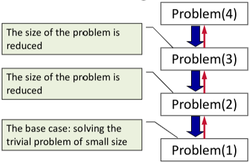

# Recursive Algorithms
#COMP2711 
Unlike [Iterative Algorithms](Iterative%20Algorithms.md), which use loops; [Recursive Algorithms](Recursive%20Algorithms.md) is a repetitive process that calls itself

## Recursive Calls
- When the current module calls a subroutine, it suspends the processing and the subroutine takes control of the program
- When the subroutine completes it returns to the module that calls it, which wakes up and continues processing from where it left off
## Preferred method for Analysing
1. Determine the algorithms main operation
2. Set up a recurrence relation with initial condition
3. Solve the recurrence or estimate the rate of growth of it's solution
