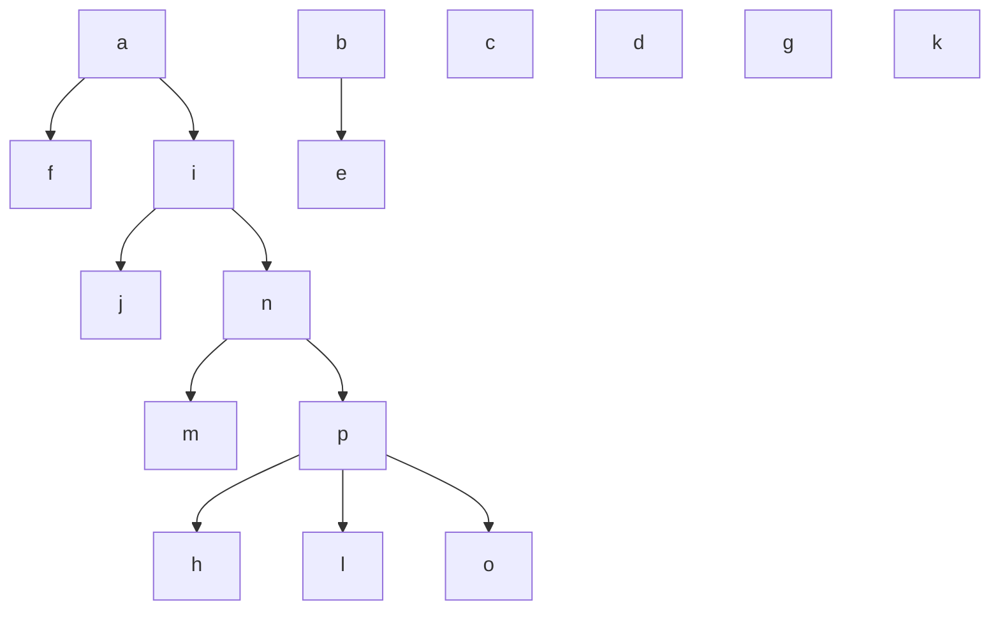
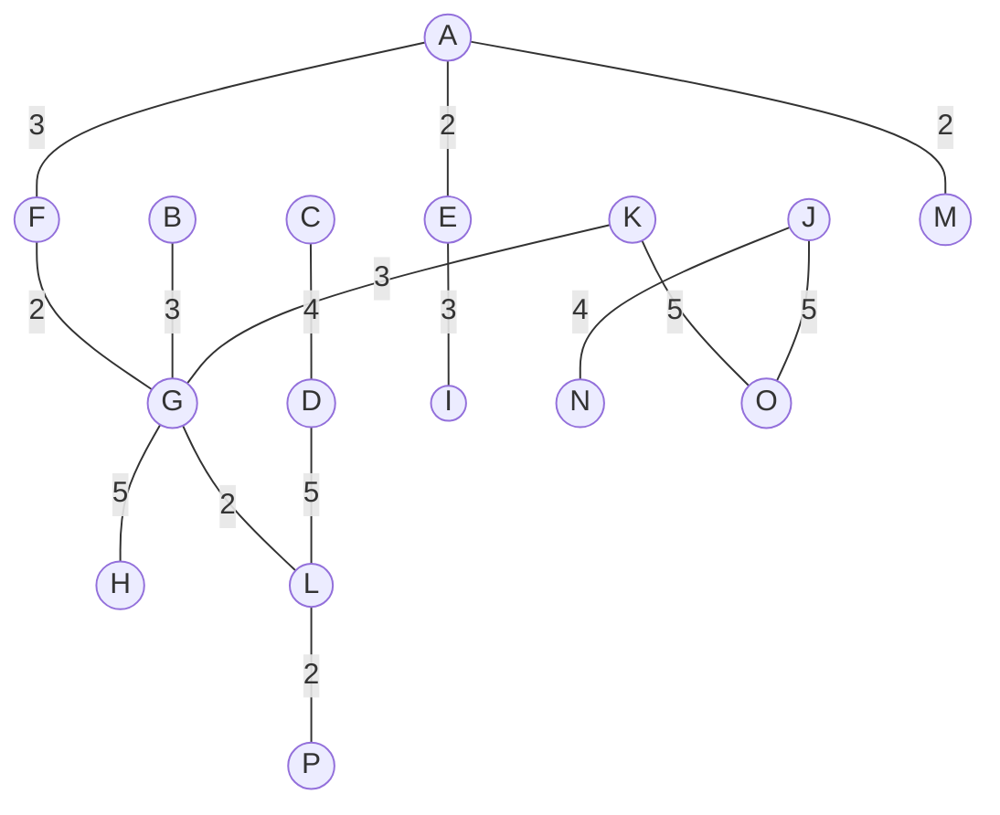

# Q1

## BFS

## DFS

# Q2

# Q3

## Khans
1. kgdc
2. beai
3. fnjp
4. olhm
## DFS

```mermaid
graph
a-->f
a-->i
i-->j
i-->n
n-->m
n-->p
p-->h
p-->l
p-->o
b-->e
c
d
g
k
```
kgdc  beai  npol  hmjf
# Q4

```mermaid
graph
A((A))
B((B))
C((C))
D((D))
E((E))
F((F))
G((G))
H((H))
I((I))
J((J))
K((K))
L((L))
M((M))
N((N))
O((O))
P((P))
A -- 2 --- E
A -- 2 --- M
F -- 2 --- G
G -- 2 --- L
L -- 2 --- P
A -- 3 --- F
B -- 3 --- G
E -- 3 --- I
K -- 3 --- G
C -- 4 --- D
J -- 4 --- N
D -- 5 --- L
K -- 5 --- O
G -- 5 --- H
J -- 5 --- O
```
