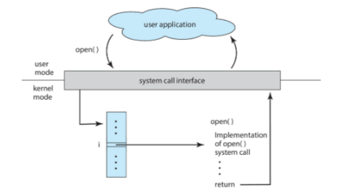

# Application Programming Interface
#COMP2211
- Most programmers will not see this level of complexity of numerous [OS services](OS%20Services.md) being used
- APIs hide away behind standard functions
- Input and output parameters are specified for each API function

## Common API's
- Windows API
- POSIX API (UNIX, linux, macos)
- Java API (Applications based on the Java Virtual Machine)