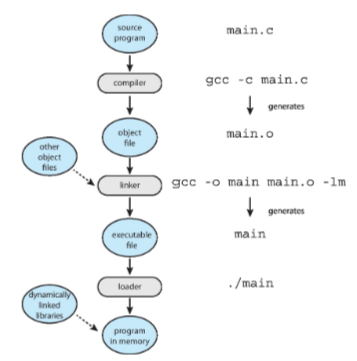

# Linkers and Loaders
#COMP2211
- Programs are stored on the disk as a binary file
- To run, the executable has to be copied to memory and placed in context of some process
- **Relocatable object file:** source code compiled into object files suitable to be moved into a particular memory location
- **Linker:** combines these objects into a binary executable
- **Loader:** loads executable into memory to be run on CPU
- **Relocation:** assigns final addresses to various parts of the executable after it is places in memory

## Running ./main
- Shell creates a new process using fork() system call
- The shell then invokes the loads with exec(); passing the name of the executable: main
- The loader loads the program into main memory using the address space of the new process
- 'Similar process occurs in GUI by double clicking the executable with the mouse'
## Dynamic Linking
- Link libraries dynamically when the program is being loaded into memory. 
- Avoid linking and loading libraries that will end up not being used in the program.
- Instead the library is loaded when, and if, it is required during run time. 
- Possible memory space improvements
## ELF Format
- Obj files typically have a standard format
- Holds machine code and metadata
- Unix uses ELF
- One data POI is an entry point - address of the instruction to execute upon the start of the program
