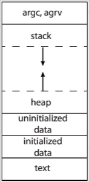

# Process
#COMP2211
- Process is a program in execution. One program invoked multiple times results in multiple processes
- Status of current activity of some process:
	- Program Counter: where are we in execution binary
	- Contents of the CPU registers: what data are we working on?
## Memory Layout
- Text section: executable code
- Data: global variables
- Heap section: Memory that grows and shrinks dynamically during execution
- Stack: structure for temporary values (function params, return addresses, local variables)
### Stack
- Small amount of data
- Can be pushed and popped
### Heap
- Heap can grow dynamically
- In C malloc and free do this for us
- Usually Stack and heap grow towards each other

[Threads](Threads.md)
