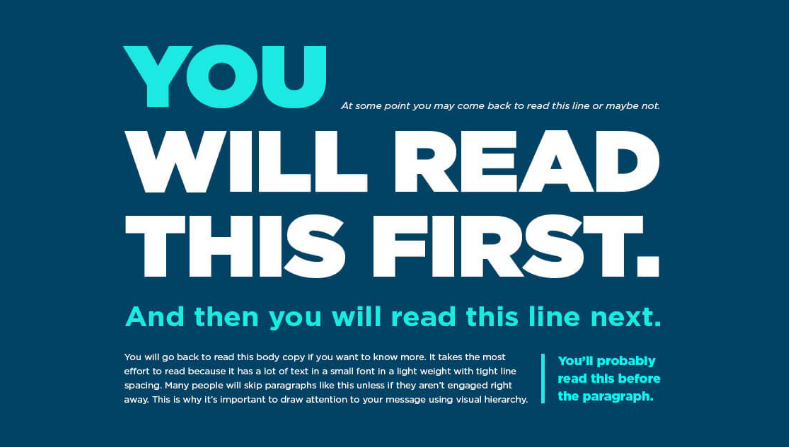
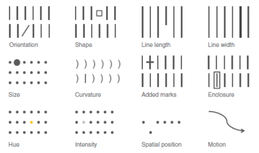
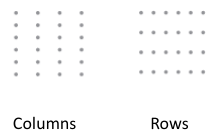
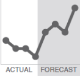
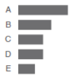
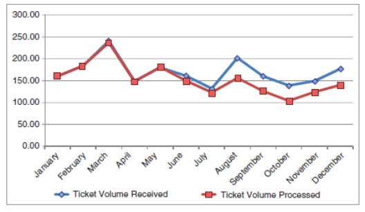
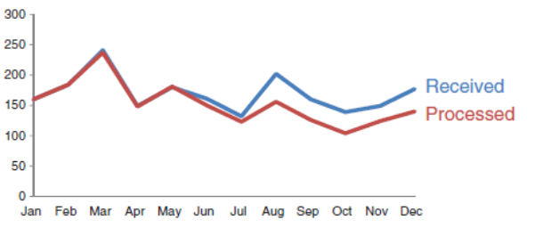

# Optimising Visualisations
## Visual Heirarchy

- Creating a visual hierarchy will mean that your audience does not have to do as much work to understand your key messages.
- Look away from your visualisation and then look back to see what your eyes are drawn to.
- Make sure that the data relating to your key points are what your eye is drawn to when you look at the visualisation.
- Remember that by highlighting something you may make other information harder to read
## Memory
- **Iconic memory** is unconscious and is ruled by pre-attentive attributes.Guide your audience to look at certain aspects of your visualisation.
- **Short term memory** can hold about 4 pieces of visual information.Do not overload or make your audience work too hard.
- **Long term memory** is “lifetime” memory.Make the message stick with your audience – story telling using visuals
## Pre-attentive Attributes
- These unconsciously grab your audiences attention and can be used to highlight your key points.
- The main pre-attentive attributes are **Colour**, $_{\text{Size}}$ and $Font$
- When creating a visual close your eyes or look away then note where your eyes are drawn to when you look back

### Colour
- Be conscious of your use of colour - resist the urge to use colour for the sake of being colourful.
- Be consistent with colours – never change colours just for the sake of novelty.
- Think about the tone you are setting with the colours you choose.
- People associate colours with different brands
- Don't have a multitude of colours, often shades is much better
- Be considerate of colourblindness - Red Green is very common
### Font
- **Bold**
- *Italics*
- <ins>underline</ins>
### Size
- We notice things that are larger first.
- If you are showing things that are of equal importance keep them at equal size.
- If one attribute or message is much more important make it bigger

## Gestalts 6 Principles of Visual Perception
!> noun Word forms: plural -stalts or -stalten (-ˈʃtæltən ) (sometimes not capital) aperceptual pattern or structure possessing qualities as a whole that cannot be described merelyas a sum of its parts.” (Collins)
The word Gestalt is used in modern German to mean the way a thing has been “placed,” or“put together.” There is no exact equivalent in English. “Form” and “shape” are the usual translations; in psychology the word is often interpreted as “pattern” or “configuration.””
### Proximity
- We tend to think of objects that are physically close together as belonging to part of a group.
- Used in tables; see there are no lines but still see in groups

### Similarity
- We presume that objects that are visually similar are all part of a group.
### Enclosure
- We think of objects that are physically enclosed together as belonging to part of agroup.
- It can draw a visual distinction within data

### Closure
People like things to be simple and fit into constructs that are already in our mind
### Continuity
- When looking at objects we seek the smoothest path and naturally create continuity even where it may not explicitly exist

### Connection
- We tend to think of objects that a physically connected as part of the same group.
- The connective property has a stronger connection than similar colour, size or shape that we saw in the similarity principle.
- However it is not stronger than enclosure.

## Cognitive Load
- Every time we take in information we experience cognitive load. It can bethought of as mental effort.
- Every single element you add to a page or screen takes up cognitive load(mental effort).
- That means we should take a discerning eye to the elements we allow on our page or screen and work to identify those things that are taking up brainpower unnecessarily and remove them.
- Visual elements that take up space and cognitive load but do not improve understanding can be seen as clutter
### White Space
- Can get the attention of your audience like a dramatic pause when someone is speaking.
- Resist the urge to fill all the space on the screen on page
### Alignment
- In the previous example we switched from centre to left justification of text to create clean horizontal lines.
- The audience will naturally start at the top left of the page or screen and move their eyesin a “z” shape.
- 45 degree rotated text is on average 52% slower to read.
- 90 degree rotated text is 205% slower to read.
- Turn on rulers or grid lines when aligning things on a page to so you can precisely align all the elements to create clean horizontal and vertical lines

## Removing Clutter

1. Remove Chart Border
2. Can you remove grid lines
3. Do you need data markers
4. Can you clean up axis labels(remove decimal point and remove tilt)
5. Label data directly
6. Leverage consistent colour (change data labels to match)

