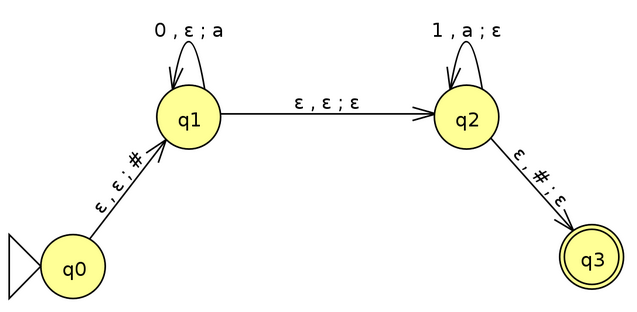

# Pushdown Automata

> [!Info] Definition
> A **pushdown automata** is a 6-tuple $(Q, \Sigma, \Gamma, \delta, q_0, F)$, where $Q$, $\Sigma$, $\Gamma$, and $F$ are all finite sets, and 
> 1. $Q$ is the set of states,
> 2. $\Sigma$ is the input alphabet,
> 3. $\Gamma$ is the stack alphabet,
> 4. $\delta: Q \times \Sigma_{\epsilon} \times \Gamma_\epsilon \rightarrow \mathcal{P} (Q \times \Gamma_\epsilon)$ is the transition function,
> 5. $q_0 \in Q$ is the start state, and
> 6. $F \subseteq Q$ is the set of accept states.

## Example

**Form > a , b ; c**
- a = symbol read from input
- b = symbol read from stack
- c = symbol pushed to stack
