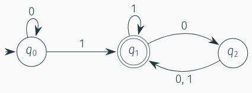

# Deterministic Finite Automata (DFA)
#COMP2321
- (Finite State Machine)
> [!Definition] Definition (Deterministic Finite State Automata)
> Is a 5-tuple $(Q, Σ, δ, q_0, F)$, where
> 1. $Q$ is a finite set called the states
> 2. $\sum$ is a finite set called the alphabet
> 3. $δ : Q × Σ \rightarrow Q$ is the transition function
> 4. $q_0 ∈ Q$ is the start state
> 5. $F ⊆ Q$ is the set of accepting states
## Formal Definition of Computation
- Let  $M = (Q, \sum , \delta, q_0, F)$ be a finite automaton
- Let $w = w_1 ... w_n$ be a string where $w_i \in \sum \text{ for } 1 \leq i \leq n$.
- The automaton  **accepts** $w$ if a sequence of states $r_0, \dots, r_n \in Q$ exists such that:
1. $r_0 = q_0$
2. $\delta (r_i, w_{i+1}) = r_{i+1} \text{ for } 0 \leq i < n$
3. $r_i \in F$

Put simply, the first condition says that the sequence of state must start with the start state. The second condition says that the sequence of states progresses in accordance with the transition function and the third condition says that the final state is an accepting state. We say that an automaton $M$ recognises a language $A$ if $A = \{w \in \sum^* | M \text{ accepts } w$.

If a **deterministic** automaton does not accept a given string then the machine **rejects** the string, and the string is not part of the language recognised by the automaton.

## Graphical Representation
Let $M = (Q, \sum, \delta, q_0, F)$
1. $Q = \set{q_0, q_1, q_2}$
2. $\sum = \set{0,1}$
3. $\delta = \set{((q_0, 0)q_0), ((q_0, 1) q_1), ((q_1, 0)q_2), ((q_1, 1)q_1), ((q_2, 0)q_1), ((q_2, 1)q_1)}$
4. $q_0 = q_0$
5. $F = \set q_1$

