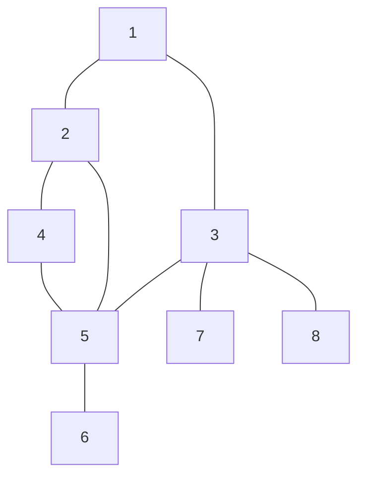

# Breadth First Search
#COMP2721 #Search 
- Explore outward from a start vertex s in all possible directions, adding nodes one “layer” at a time
## Algorithm
1. $L_0 = \{s\}$
2. $L_1 = \text{all neighbours of vertices in } L_0$
3. $L_2 = \text{all vertices that are not in }L_0 or L_1 \text{ and are ajacent to a vertex in } L_1$
4. $L_{i+1} = \text{all vertices that are not in any previous layer and that are connected via an edge to a vertex in } Li$
### Big O
- $O(m+n)$
## Graph
BFS List: [1,2,3,4,5,7,8,6]
- Order of visited nodes

(Same graph as in [Depth First Search](Depth%20First%20Search.md) but visits in a different order)