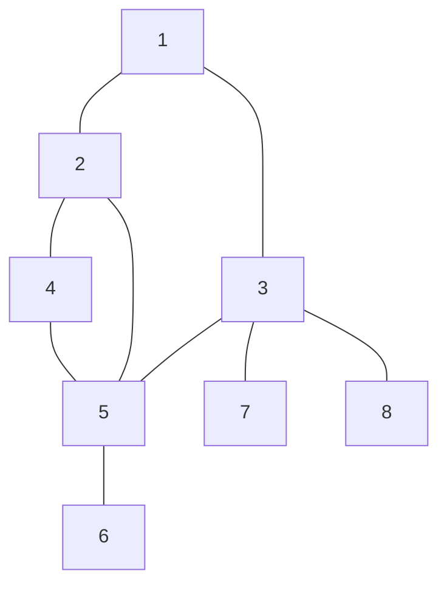
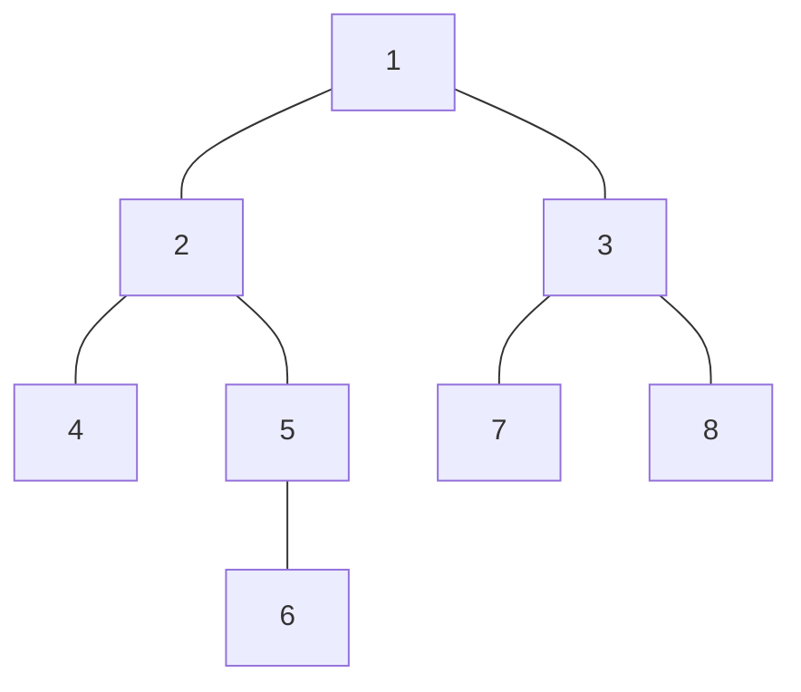

# Depth First Search
#COMP2721 #Search 
- From a visited node go first to another not yet visited neighbour (recursive call)before visiting its other neighbours
### Big O
- $O(m+n)$
## Graph
DFS List: [1,2,4,5,6,3,7,8]
- Order of visited nodes

(Same graph as in [Breadth First Search](Breadth%20First%20Search.md) but visits in a different order)
## DFS Tree

