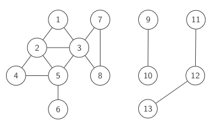

# Connected Component
- A maximal connected subgraph of a graph is called a connected component. A disconnected graph is the disjoint union of its connected components
- Example: A disconnected graph with 3 connected components. 
## Identifying connected components: 
- Find all nodes that can be reached from $s$
### Solution
- call [DFS](../Algorithms/Depth%20First%20Search.md)(G,s) or [BFS](../Algorithms/Breadth%20First%20Search.md)(G,s).
- A node u is reachable from s if and only if visited[u]=true