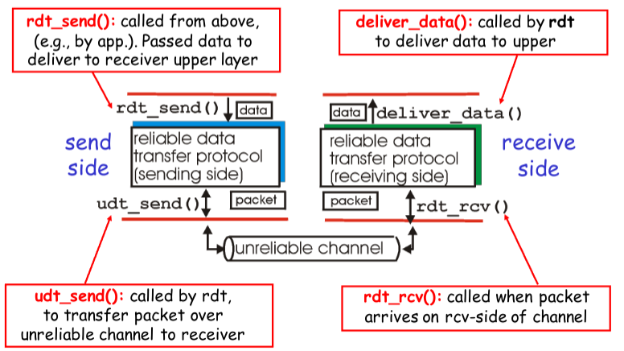

# Transport Layer
- Provides ports to control data transfer between processes
- Raw data packets can be corrupted, arrive out-of-order, or not arrive at all!
- Essentially two protocols exist at this layer:
	- [TCP](TCP.md)  - Transmission Control Protocol
		- Ensures all packets/segments are received
		- May ask for re-transmission
		- Can have a high overhead
	- [UDP](UDP.md) - User Datagram Protocol
		- Detects corruption, but not ordering or lost pack-ets/segments
		- Low overhead

## Reliable Data Transfer

