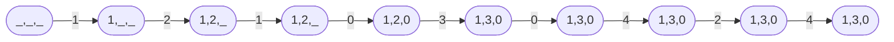

# Page Replacement Algorithms
#COMP2211 
- Page replacement schemes (algorithms) are used when there is a page fault (page stored on disk not in memory), and there is not enough space in the main memory to allocate the new page
- A page replacement algorithm decides which page it should replace so that it can allocate the memory for the new page
- Not used pages can be moved from memory to the disk
## Process
- Page Fault generates alert for OS
- OS then retrieves the page from the secondary or virtual memory to the main memory (takes a few ms)
- A high number of page faults can slow down the whole system. Although page faults are common, a large number of page faults may cause the program to crash or terminate unexpectedly
## 1. FIFO
- First In First Out
- The oldest page would always be in the front position in the queue
### Advantages
- Simple to implement with a [Queue](../../Mathematics/Algorithms/Queues.md)
- Low computational overheads
- Ideal for small systems
### Disadvantages
- Poor performance when lots of incoming pages
- Every frame/page needs to be tracked
- Needs an additional data structure to do so
You might think that we could just increase the size of the queue and magically page faults would decrease. BUT often we find that page faults actually increase instead. This is because of something called [Belady’s anomaly](https://en.wikipedia.org/wiki/B%C3%A9l%C3%A1dy's_anomaly)
## 2. LRU
- Least Recently Used
- Replace page used the longest time ago
- Locality of Reference: If a page hasn't been used for a long time it's unlikely to be used soon
### Example
Let’s say we have a bunch of inbound page requests (some are repeats this time)and just three free memory locations:
	1, 2, 1, 0, 3, 0, 4, 2, 4
Initially, all slots are empty

### Advantages
- The page that has not been used for the longest time gets replaced
- It gives fewer page faults than any other algorithm
- The algorithm never suffers from the Belady's anomaly
### Disadvantages
- Computationally expensive
- Often needs a specialist hardware design to implement
- Error detection is quite difficult
## Measuring Effectiveness
- The effectiveness of a page replacement algorithm is measured by the number of page fault it generates
- The more effective the page replacement algorithm is, the less the number of page faults generated by the algorithm.