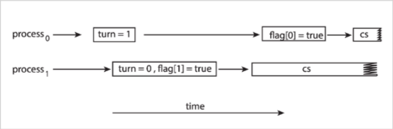

# Process Synchronisation
#COMP2211
- Multiple [Threads](Threads.md) may want to update data at the same time
## Race Conditions
- When several processes manipulate data concurrently
- Outcomes can change on a different run of a multi-thread application
- Can arise in OS as different parts manipulate shared resources
- Also arise in multi-threaded user applications
## Critical Section Problem
Consider a system with n processes/threads $P_0, P_1, ..., P_{n−1}$.
- Each process has a critical section of code.
- In that section, shared data is being accessed (shared among at least two processes).
- When a process is executing instructions in the critical section, no other process can do so.
- Each process must request permission to enter their critical section
```c
while(true)
{
	// Implements the request
	ENTRY SECTION
		CRITICAL SECTION
	// May do sometidying up after the critical section
	EXIT SECTION
	// Rest of code
	remander section
}
```
### Solutions Should Meet the Following:
1. **Mutual Exclusion**: Only one $P_i$ can be in a critical section
2. **Progress**: If one process asks to execute it's critical section, only processes not in their remainder section can participate
3. **Bounded Waiting**: There should be a limit on a number times other processes can enter their *critical sections,* when some other process is waiting. Avoid the problem of [process starvation](Scheduling.md)
### Solving
- **Single Core:** disable interrupts during execution of critical code
	- Will not solve for multi-processor systems
#### Kernel
- **Preemptive Kernels:** 
	- Allows processes to be interrupted while in kernel mode
	- Favoured as they are more responsive
	- Still haven't solved the Critical Section Problem
- **Non-preemptive Kernels:**
	- Does not allow processes to be interrupted while in kernel mode
	- Safe from race conditions on kernel data structures
#### Peterson's Solution
- No guarantee this works on modern architectures
- Good starting point
- Restricted to two processes
```c
while (true)
{
	flag[i] = true;
	turn = j;
	while (flag[j] && turn = = j);
		
		/* critical section */
		
	flag[i] = flase;
	
	/* remainder section */
}
```
- May not work due to **instruction reordering**
	- Is performed where there is no data dependencies
	- On single threading reordering does on impact final result
	- Multi-threading applications it may change the final result
	```c
	x = 1;
	f = true;
	// Compiler might run other way round
	// As the expressions don't depend on each other
	f = true;
	x = 1;
```

