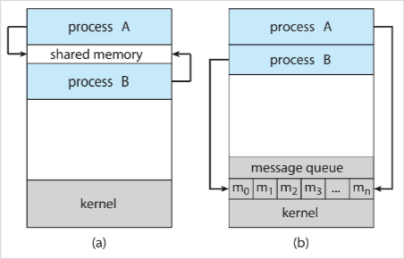

# Process
#COMP2211
- A process is a **program in execution**. One program invoked multiple times results in multiple processes
- Status of current activity of some process:
	- Program Counter: where are we in execution binary
	- Contents of the CPU [registers](../Hardware/Registers.md): what data are we working on?
## Memory Layout
- Text section: executable code
- Data: global variables
- Heap section: Memory that grows and shrinks dynamically during execution
- Stack: structure for temporary values (function params, return addresses, local variables)
### Stack
- Small amount of data
- Can be pushed and popped
### Heap
- Heap can grow dynamically
- In C malloc and free do this for us
- Usually Stack and heap grow towards each other

[Threads](Threads.md)
## Life-cycle

## Inter-process Communication

### Ordinary Pipes
- Produced-consumer model: producer writes to the write end of the pipe while the
consumer reads from the read end.
- Unidirectional: we need two pipes for communicating back to the producer.
- In UNIX this is constructed using pipe(int p[]) where p[0] is the read end of the pipe and p[1] is the write end.
- p[0] and p[1] are special types of files in UNIX, therefore fork() in the parent will make the child inherit these