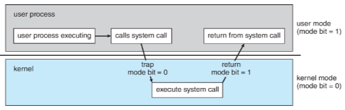

# Processor Systems
#COMP2211
## Main Terms
- CPU: The hardware that executes instructions.
- Process: A physical chip that contains one or more CPUs
- Core: The basic computation unit of the CPU.
- Multi-core: Including multiple computing cores on the same CPU.
- Multiprocessor: Including multiple processors
## Single-Processor Systems
- Single processor containing one CPU with a single processing core - many years ago.
- The core is the main piece of hardware within a CPU that executed program instructions and managed register storage locally.
- General purpose or domain specific: can run general programs or can runs a limited set of operations optimised for some task/s.
- A computer system may have one general purpose single-processor CPU and multiple domain-specific processors that accelerate some specific tasks. From the perspective of OS, this system is still a single processor
## Multi-Processor Systems
- THEY DOMINATE
- Two or more processors, each with a single-core CPU
- Increase throughput
- Ideally N processors should result in N times speed up. In reality it is less:there is some overhead in managing multiple processors that cooperate on some task. This overhead does not exist when only one processor is executing

## Multiprogramming
- Single Programs can't keep CPU occupied due to wait times so will switch between programs to keep busy
- When 1 process pauses executing as it's waiting for an I/O, the CPU is allocated to another process that is ready to run.

## Multitasking
- Similar to multiprogramming, but the switches between processes are very frequent to provide users with a fast response time
## User/Kernel Modes
- Incorrect or malicious programs should not be able to break the OS, execute code that belongs to [OS services](OS%20Services.md), or take over hardware resources
- $\therefore$ Split apps into user mode
- [OS services](OS%20Services.md) and the kernel are executed in the system mode
- User programs are in user mode. 
- Once program requests some important resources, it can go into the kernel mode forsome specific tasks, system calls

## Timer: Periodic [[Interrupts]] from OS
- For the OS to maintain control over the CPU we need protection against user program getting stuck in infinite loop or similar.
- Timer is set to [[Interrupts|Interrupt]] the computer after a specified period.
- Period can be fixed or variable.OS sets up the timer before transferring control to user programs. When the timer interrupt occurs OS gets control and can decide whether to abort the program or let it run longer.
- Instructions that set up the timer are privileged instructions—hardware operations that can only be executed in kernel mode