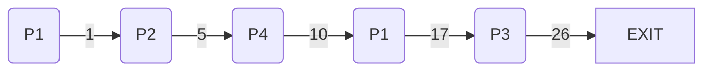

# Scheduling
#COMP2211
When processes wait for IO, CPU can be used for something else
## CPU Scheduler
- Selects a process from the ready queue and allocated CPU to it.
- Queue may be ordered in various ways
### Challenges
- Process 1 is writing data, is preempted by process 2 that reads the same data
- Process 1 asks kernel to do some important changes, process 2 [interrupts](Interrupts.md) while they are being done
#### Disabling [interrupts](Interrupts.md)
Irrespective of the challenges, most modern operating systems are fully preemptive when running in kernel mode, but disable [interrupts](Interrupts.md) on certain small areas of code
## Dispatcher
Gives control of the CPU to the scheduled process
- Switching context
- Switching to user mode (kernel tasks in supervisor mode)
- Jumping to the proper location in the previously interrupted user program (set the Program Counter register)
Dispatch latency - Time it takes for the dispatcher to stop one process and start another running
## Scheduling Criteria
- **CPU Utilisation** - reduce amount of time the CPU is idle
- **Throughput** - number of processes completed per time unit
- **Turnaround time** - amount of time to execute a particular process
- **Response time** - amount of time it takes from when a request was submitted until the first response is produced, not output (for time-sharing environment)
## Scheduling Algorithms
### Types
#### First-Come, First-Served (FCFS) - FIFO
- First in = First out
- If a long process comes in just before a short one, the average wait time is large
#### Shortest-Job-First (SJF) i.e. shortest-next-CPU-burst
- Append each process with the length of next CPU burst.
- Schedule jobs with shortest time.
- SJF is optimal, but difficult to know future CPU burst lengths.
##### CPU Burst
- It is the amount of time required by a process or can be said the amount of time required by the process to finish. 
- We can not estimate the time taken by the process before running it. So most of the problem is related to the burst time.  
- Burst Time= Turn around Time(Completion Time)-Waiting Time
#### Preemptive SJF
- It can interrupt a currently running process if the original process would run longer than some new process
#### Example
| Process | Arrival Time | Next Burst Time |
| ---- | ---- | ---- |
| $P_1$ | 0 | 8 |
| $P_2$ | 1 | 4 |
| $P_3$ | 2 | 9 |
| $P_4$ | 3 | 5 |

#### Shortest-remaining-time-first
- Shortest-job-first is a specific case of general scheduler that decides by priorities.
- If we allow SJF to be preemptive, it can interrupt a currently running process if it would run longer than some new process
#### Priority Scheduling
- A priority (integer) associated with each process.
- CPU allocated to a process of highest priority.
- Starvation—low priority processes may not execute.
- Ageing—increase the priority proportional to waiting time.
- Internal priorities—time limits, memory requirements, ratio of average I/O burst.
- External priorities—importance of the process, type and amount of funds being paid for the CPUs, who is asking to run the process, and other
#### Round Robin Scheduling
- **Quantum** - max time for a process to complete, can give up early
- Small quantum - too many [interrupts](Interrupts.md) will reduce performance.
- Big quantum - scheduler similar to FCFS.
- Need a balance (according to OSC, usually q = 10 to 100 ms).
- Context switch around 10 microseconds (small fraction of q)
### Characteristics
| Algorithm | (Dis)advantages |
| ---- | ---- |
| FCFS | Convoy Effect - Long Problems hold the queue |
| SJF | Need to predict future CPU burst lengths |
| Preemptive SJF | Better Average wait time than SJF |
| Priority Scheduler | Starvation |
| RR | Need to tune quantum time to avoid expensive quantum switch |
## Process Starvation
- Low priority processes never execute
- Solved through **Ageing**
	- Increase priority based on how long its been waiting