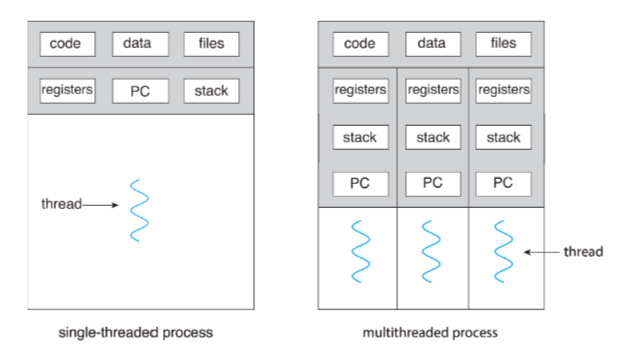

# Threads
#COMP2211
A basic unit of CPU utilisation; it comprises a thread ID, a program counter (PC), a register set, and a stack
Same threads within a process share: 
- code section
- data section
- other resources (for example open files).
A traditional [Process](Processor%20Systems.md) has a single thread of control.
Processes with multiple threads can perform more than one task at a time

## Terminology
- **Cores** are physical processing units.
- **Threads** are virtual sequences of instructions given to a CPU. 
- **Multithreading** allows for better utilisation of available system resources by dividing tasks into separate threads and running them in parallel.
- **Hyperthreading** further increases performance by allowing processors to execute two threads concurrently.
- Concurrency
	- Single Core: interleaving the execution of threads in time
	- Multi Core: some threads can execute simultaneously meaning there is parallelism
## Benefits
- Responsiveness: if one part of an application blocks, other threads can continue working
- Resource sharing: threads share memory resources of a process to which they belong
- Economy: allocating resources when creating processes is costly; context switch is also costly. Threads are cheaper in both aspects
- Scalability: Multi-threaded processes can exploit multiple cores, whereas a single-threaded ones can only run on one core
## Challenges
Coding:
- Operating Systems have to accommodate multi-core hardware
- Old single threaded applications have to be ported
- New algorithms have to be developed from scratch (parallel algorithms)
  1. Identifying tasks: examine applications and find workloads that can be divided, ideally into independent tasks.
  2. Balance: make sure parallel tasks perform similar amounts of work.
  3. Data splitting: The data accessed and manipulated by parallel tasks have to be divided.
  4. Data dependency: Do tasks depend on output data from other tasks; synchronisation may be required.
  5. Testing and debugging: Program running on N cores has many execution paths. Debugging is more difficult than in a single-threaded case
## Types of Parallelism
- Data parallelism: Distribute data across N cores, each to receive a subset of the whole data.
- Task parallelism: distribute different tasks (operations) across multiple cores. Each task may require part or the whole of the input data.
In Practice you may see a hybrid approach
## Amdahl's Law
What speedup can we expect when we add additional cores to an application that containboth serial and parallel parts?
$$\text{speedup} \leq \frac{1}{S+\frac{1-S}{N}}$$
$N$ - number of cores
$S$ - portion of the application that must be performed serially

