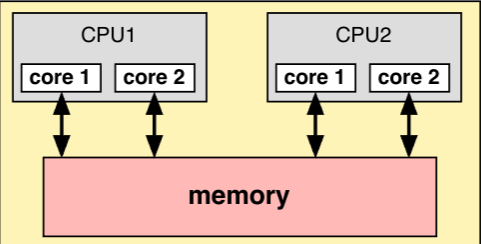

# Parallel Computation
*Writing software that makes use of hardware capable of performing calculations simultaneously*
## Automated Parallelism
- Don't Scale
**Instruction-level Parallelism (ILP)**
- Pipelining architecture in which each instruction is processed in different stages
- Different stages for subsequent instructions can be performed simultaneously
CPUs also have **multiple functional units**
- E.G. FPUs, ALUs etc that can work independently
- Super scalar architectures can merge nearby calculations into a single one

## Current Parallel Architectures
Pro: Scales better than automated parallelism
Con: Software must be specifically developed to take into account these processing units
### Shared memory architectures
All processing units access the same memory
- Includes anything with one or more multi-core CPU (most modern laptops, phones ..etc)

### Distributed memory architectures
Processing units only access a fraction of total memory available
- Includes High-Performance Computing (HPC) clusters (e.g. supercomputers), and distributed systems (‘cloud computing’)
### Graphics Processing Units (GPUs)
Hardware specifically designed to rapidly perform calculations that arise in the graphical rendering of scenes
- Historically driven by graphics applications, especially video games, but increasing being used for non-graphical applications such as machine learning, cryptocurrencies
- Some devices design for general-purpose calculations
	- Known as GPGPUs for General-Purpose GPUs
- GPU hardware has multiple memory stores, some of which can be viewed as distributed, some shared

## Programming in Parallel
Parallel architectures allow multiple calculations to be performed simultaneously
- Can improve performance without increasing the clock speed
### Concurrency
*When two or more tasks are in progress at the same time*
For instance, for an event-driven GUI, a user event (e.g. a mouse click) might result in a callback function being called.  
- Would normally be called by a separate task (thread), so that the main loop can continue (and detect other user events)
- Can be achieved using interrupts:  
	- OS ‘slices’ CPU time amongst all running tasks.  
	- Most commonly preemptive multi-tasking
### Parallelism
*The ability to perform multiple calculations simultaneously by using more than one processing unit*
**Possible to be concurrent but not parallel**
- Multi-tasking is possible in a single-core CPU, 

### Processes versus threads
**Process:**
- Self contained execution environment
- Private set of run-time resources
- Has its own heap memory
- Has its own stack memory
- Expensive to create and destroy
- Normally 1 application = 1 process (not always):
	- E.G: Each tab in an app may be a different process
**Threads:**
- Launched by and exist within a process
- Every process has at least one (the main thread in java)
- Have their own stack memory
- Shares the heap memory with the launching process
	- Potential problems if multiple concurrent threads can read and write the same data
- Lightweight; small cost for creating and destroying threads
- How threads are assigned to cores is up to the OS (the scheduler)
