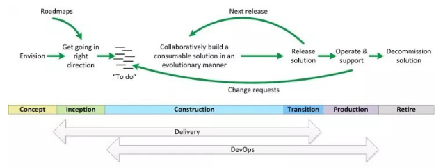

# DevOps
#COMP2912 
- A set of practices that combines software development (Dev) and IT operations (Ops)
- Aims to shorten the systems development life cycle and provide high quality, continuous delivery
- Complementary with [Agile](../../Professional%20Computing/Agile.md), Kanban etc and Disciplined Agile Development ([DAD](../../Professional%20Computing/DAD.md))
