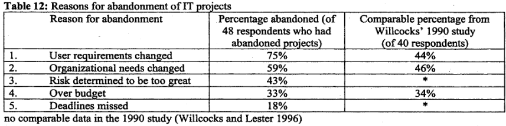
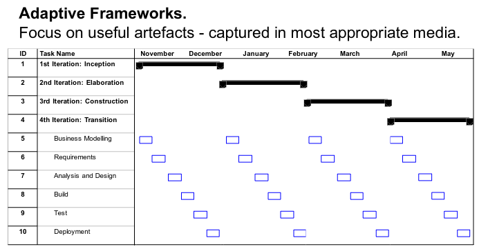

# Software Development Pronciples
#COMP2912
Fred Brookes - characteristics of software that makes it different:
- Invisibility; progress in building software can’t be seen
- Complexity; software is more complex than other engineered products
- Conformity; software conforms to human “rules” rather than physical rules like gravity, human rules are subject to change.
- Flexibility; software is flexible, it is subject to a high degree of change throughout it’s life but this change brings further complexity
## Failure
A Project that has been cancelled or does not meet its budget, delivery or business objectives

If we are building software we need to build fast not much, need a MVP
As software is not set in stone you can change it therefore it is easy to change over time
https://web.archive.org/web/20160910002130/http:/worrydream.com/refs/Brooks-NoSilverBullet.pdf
For final year project try to use the Unified Process style

Similar to Test Driven Development and [Software Development Life Cycle](../../Professional%20Computing/Software%20Development%20Life%20Cycle.md)
<marquee>I LOVE AGILE  </marguee>
## Disciplined [Agile](Agile.md) Development
- [DAD](../../Professional%20Computing/DAD.md) is the most recent form of the unified process
- 4 Phases of a Unified Process Project
	1. Inception
	2. Elaboration
	3. Construction
	4. Transition
## [eXtreme Programming](../../Professional%20Computing/eXtreme%20Programming.md)
- New versions built several times a day
- Increments delivered every 2 weeks
- All tests must be run for every build and is only accepted if all tests run correctly

## Scrum
- Comes from rugby
- Sprints are 2-4 weeks
- Has a product backlog which in each sprint you decide which problem needs to be solved
- No more than 7 in a team (8 should be 2 teams of 4)

## Kanban
- For 5 year olds
- Have Backlog, To-do, Doing, Done
- Can work alongside scrum
