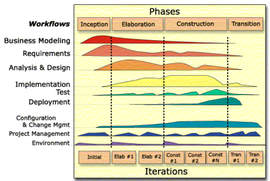
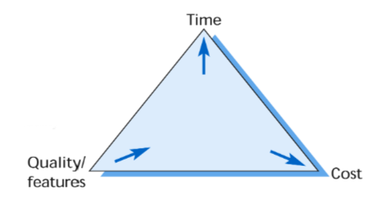
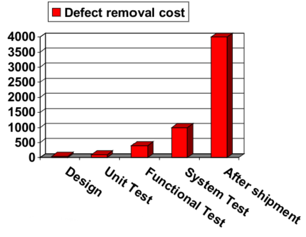

# Testing
#COMP2912
## Unified Process

## Test-driven development (TDD)
- An approach to program development in which you inter-leave testing and code development. 
- Tests are written before code and ‘passing’ the tests is the critical driver of development.
- You develop code incrementally, along with a test for that increment. 
- You don’t move on to the next increment until the code that you have developed passes its test. 
- TDD was introduced as part of [agile](Agile.md) methods such as [eXtreme Programming](../../Professional%20Computing/eXtreme%20Programming.md) However, it can also be used in plan-driven development processes
### Benefits
- Code coverage - Every code segment that you write has at least one associated test so all code written has at least one test.
- Regression testing - A regression test suite is developed as a program is developed.
- Simplified debugging - When a test fails, it should be obvious where the problem lies.
- System documentation - The tests themselves are a form of documentation
## Unit Testing
- The process of testing individual components in isolation.
- Units may be:
	- Individual functions or methods within an object
	- Object classes with several attributes and methods
	- Components with defined interfaces used to access their functionality.
### Automated Unit Testing
- Whenever possible, unit testing should be automated so that tests are run and checked without manual intervention. 
- In automated unit testing, you make use of a test automation framework (such as JUnit) to write and run your program tests.
- Unit testing frameworks provide generic test classes that you extend to create specific test cases.
- They can then run all of the tests that you have implemented and report, often through some GUI, on the success of otherwise of the tests.
- **Setup** where you initialise the system with the test case, namely the inputs and expected outputs.
- **Call** where you call the object or method to be tested.
- **Assertion** where you compare the result of the call with the expected result.If true, the test has been successful if false, then it has failed
## Input Output Testing
- Run the code with artificial data
- Check the results for anomalies, or info about non functional attributes
## Choosing Tests
Two types of unit test
- The first of these should reflect normal operation of a program and shouldshow that the component works as expected
- The first of these should reflect normal operation of a program and shouldshow that the component works as expected
## Regression Testing
- A regression is an unintended side effect, within a component or system, of a change elsewhere in the component or system, or in the component’s or system’s run-time environment.
- A regression is an unintended side effect, within a component or system, of a change elsewhere in the component or system, or in the component’s or system’s run-time environment.
- In a manual testing process, regression testing is expensive but, with automated testing, it is simple and straightforward.
- All tests are rerun every time a change is made to the program
## Why Test
### Build Quality
Quality is an emergent property of the system and it’s software
- Poor Reliability
- Scalability
- Usability, 
- etc... etc...
#### Trade off Triangle

### Cost Of Removing Bugs
