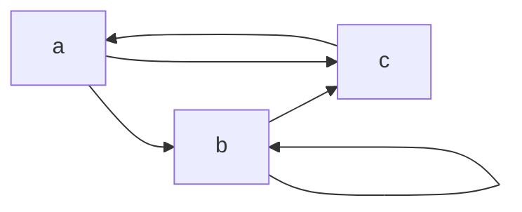

#logic #COMP1421 #Maths  
- Relations are subsets or Cartesian products
- if $f : A \rightarrow B$ is a function
- then the relation is $f = {(a,b) | a\in A, b\in B, and\space b = f(a)}$
## Reflexive:
- every element has a relationship with itself
- $(a,a)\in R$ for all $a\in R$
- $\forall x (x,x) \in R$ 
## Symmetric:
- if an element($x$) has a relationship with another element($y$) then element($y$) has a relationship with element($x$)
- $(a,b)\in R$ implies $(b,a)\in R$ for all $a,b\in A$
- $\forall x\forall y((x,y)\in R \rightarrow(y,x)\in R)$
## Anti-symmetric:
- If element($x$) has a relationship with element($y$) and element($y$) has a relationship with element($x$) then $x=y$
- $(a,b)\in R$ implies $(b,a)\in R$ for all $a,b\in A$ then $a=b$
- $\forall x\forall y(((x,y)\in R \wedge (y,x)\in R) \rightarrow x=y)$
## Transitive:
- If element $x$ relates to $y$ and $y$ relates to $z$ then $x$ relates to $z$, this means if there is a route that goes through multiple vertices then there also must be a direct route as well
- $(a,b)\in R$ and $(b,c)\in R$, then $(a,c)\in R$ for all $a,b,c \in A$
- $\forall x \forall y \forall z (((x,y) \in R \wedge (y,z) \in R ) \rightarrow (x,z) \in R)$
## Total:
- every element must have a relation with every other element, be it $x\rightarrow y$ or $y\rightarrow x$
- if all $(a,b) \in A$ satisfy: $(a,b) \in R$ or $(b,a) \in R$
- $\forall x \forall y ((x,y) \in R \vee (y,x) \in R)$domain is set of all elements $A$
## Combinations
### Preorder:
- reflexive
- transitive
### Partial order
- reflexive
- transitive
- anti symmetric
### Linear order (total order):
- reflexive
- transitive
- anti symmetric
- total

## Equivalences
 An equivalence relation is a binary relation, that is reflexive, transitive and symmetric.

### Graphs
- Used in [[Graph Theory]]
- A graph set $G = (V,E)$
- Where $E\subset {(i, j) | i \in V , j \in V }$
- For graph G with Vertices, $V := \{a, b, c\}$ and Edges, $E := \{(a, b), (b, b), (b, c), (c, a), (a, c)\}$

