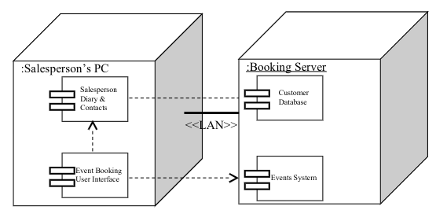

# UML
#COMP1911
## Unified Modelling Language (UML)
- The de-facto standard for modelling systems
“The Unified Modelling Language (UML) is a language for specifying, visualising,constructing, and documenting the artefacts of software systems, as well as for business modelling and other non-software systems. The UML represents a collection of best engineering practices that have proven successful in the modelling of large and complex systems.” - www.omg.org   

---
### Diagrams
- Often spilt into structural information diagrams or behaviour diagrams

---
## Requirements View
---
### Use Case Diagram
- [Use cases](Use%20Cases.md) were developed originally to support requirements investigation and are incorporated into UML.
- Use case diagrams provide a user friendly overview of what the system does
- Need a name of system 
- Use Cases have at least a verb and a noun
- White arrow means is part of

---
## Logical Views
---
### Class Diagram
#### For analysis

---
#### For Design
Class diagrams can be refined by modelling to form a logical model which can be used as part of the technical design for object-oriented software

---
### Object diagram
- an instance of a class diagram
- Basically the same as a Class diagram but showing single Object
- Instances and their individual relationships rather than Classes and the general relationships

---
## Dynamic Views
### Collaboration Diagram
- Note that these are Object diagrams with added message arrows to show the messages.
- These diagrams show the sequence of message sent between collaborating objects for a particular task.
- The diagrams highlight the relationships between the collaborating objects

### Sequence Diagram
- These diagrams show the sequence of message sent between collaborating objects for a particular task
- They highlight the flow of control between the objects

### State Diagram
- finite state machine

### Activity Diagrams
- basically like a flow chart
- They have
	- decision points
	- synchronisation bars
- The synchronisation bars show activities that can happen in either order or even at the same time

#### With Swim Lanes

## Physical Views
### Component Diagrams
- Component diagrams illustrate the physical structure of the system in terms of its Software
- They show the software components and the dependencies between them

### Deployment diagrams
- Physical Architecture in terms of hardware
- Will always have communication links between nodes

### Implementation Diagrams
Includes both component and Deployment

