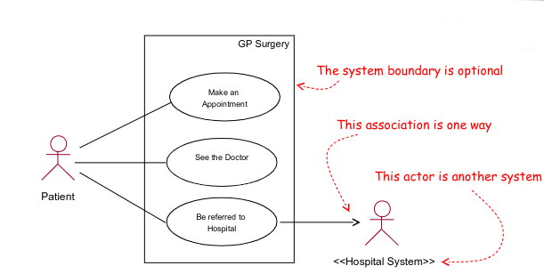

#COMP1911
## Unified Modelling Language (UML)
- the de-facto standard for modelling systems
“The Unified Modelling Language (UML) is a language for specifying, visualising,constructing, and documenting the artefacts of software systems, as well as for business modelling and other non-software systems. The UML represents a collection of best engineering practices that have proven successful in the modelling of large and complex systems.” - www.omg.org

### Diagrams
- often spilt into structural information diagrams or behaviour diagrams

## Requirements View
---
### Use Case Diagram
- Use cases were developed originally to support requirements investigation and are incorporated into UML.
- Use case diagrams provide a user friendly overview of what the system does

## Logical Views
### Class Diagram
### Object diagram
- an instance of a class diagram
## Dynamic Views
### Collaboration Diagram
![[Pasted image 20221107134655.png]]
### Sequence Diagram
- These diagrams show the sequence of message sent between collaborating objects for a particular task
- They highlight the flow of control between the objects
![[Pasted image 20221107134518.png]]
### State Diagram
- finite state machine
![[Pasted image 20221107134903.png]]
### Activity Diagrams
- basically like a flow chart
- l includes synchronisation bars or swim lanes
## Physical Views
### Component Diagrams
- Component diagrams illustrate the physical structure of the system in terms of its Software
- They show the software components and the dependencies between them
![[Pasted image 20221107135243.png]]
### Deployment diagrams
- Physical Architecture in terms of hardware
- Will always have communication links between nodes

### Implementation Diagrams
Includes both component and Deployment
![[Pasted image 20221107135411.png]]
