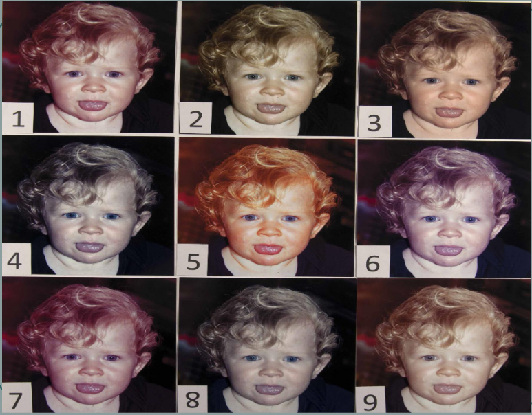

#COLO1070
## Phone Cameras
>We are in the era of news served raw.  Witnesses to any event can now capture and  share what they see not just with  acquaintances but with the world, and without  the filter and delay of news media ...we also
>have access to the guts of news – original  documents, full transcripts, unedited video.  Life is on record’ – Jeff Jarvis / Media  Commentator & Professor of Interactive  Journalism
- journalists started taking photos from phone cameras as there was no professional photos available
## Compact Digital Cameras
- CCD or CMOS imaging sensor  
- Image resolution 10 – 24 megapixels  
- LCD display  
- Optical zoom (minimum focal length = 20mm,  maximum focal length = 1200mm)  
- Built-in flash capability  
- Most have HD movie-mode capability  
- Image stabilisation  
- 3D Compact Cameras now available

## Bridge Digital CamerasHigher-end digital cameras that ergonomically  
- resemble a mini-size DSLR  
- Also have much in common with Compact digital  cameras i.e. a fixed lens and a small size sensor (hence the term Bridge)  
- Fitted with large zoom range lens (often called Superzoom cameras)  
- Utilise image stabilisation  
- Built-in flash  
- Can store images in Raw or JPEG
- small sensor and lens ( can zoom a lot but might discrease quality )

## Hybrid/Compact System
- Contain large sensors within small camera bodies and have manual control  
- Interchangeable lenses but do not have a mirror box or an optical viewfinder  
- Produced by Nikon, Canon, Pentax, Sony and Fujifilm 
- Panasonic and Olympus produce Micro Four Thirds platform versions
- The Hybrid/CS camera has already  claimed ~17% of the DSLR market in  Japan  
- Resolution is in the range 10 to 36  mega pixels  
- Maximum ISO speed is 6400 to 25600  
- Many of the cameras have HD movie-mode

## Prosumer Digital Camera
- Image sensor either CCD or CMOS type  
- DSLR category & therefore capable of accepting a wide range of focal length lenses – or zoom lenses  
- Real size optical viewfinder, or pentaprism, with 95-100% image coverage  
- Built-in flash plus added hotshoe  
- Record both JPEG & RAW files  
- Bodies tend to be more lightweight and less robust than the equivalent professional models e.g. less metal and more polycarbonate
- These cameras tend to offer RAW processing:  
- Adjust white balance and exposure  
- Picture control  
- Colour space  
- D-Lighting  
- ISO noise reduction & vignetting control  
- Final result can be saved as JPEG file

## Professional Digital Cameras
- Includes 35 mm format DSLR’s, medium format DSLR’s & medium format/large format digital camera backs  
- Image sensor either CCD or CMOS type  
- Current top of the range 35 mm DSLR’s = Canon EOS 1DX Mk iii full frame 20.1 Mega Pixel CMOS sensor & Nikon D6 full frame 20.8 Mega pixel CMOS  sensor  
- Record both JPEG & RAW files simultaneously  
- Multi-image recording – 4/12 frames per second capability

- Produce different film for different parts of the world

| red     | Green           | Warm   |
| ------- | --------------- | ------ |
| Blue    | Inc Saturation  | Cyan   |
| Magenta | As Shot         | Yellow | 

## Digital Cameras / One-Exposure Single Matrix
![[Pasted image 20230220153905.png]]

## Digital Cameras / Three-Exposure Single Matrix
![[Pasted image 20230220153935.png]]

## Digital Cameras / One-Exposure Triple Matrix
![[Pasted image 20230220154003.png]]

## Digital Cameras  / Scanning Trilinear Array
![[Pasted image 20230220154033.png]]

## Digital Cameras / Multi-Exposure Single Matrix [ with sub-element shift ]
![[Pasted image 20230220154104.png]]

## Digital Cameras / Multi-Exposure Single  Matrix [ with whole-element shift ]
![[Pasted image 20230220154135.png]]

## Current Development
- Combined Stills & Movie DSLR’s
- Nikon D850 and Canon  EOS 5D Mk III still  cameras with combined  movie mode capability
- Casio Exilim Pro EX-F1  model is a high speed  stills and high speed  movie mode camera  
- HSS = 60fps & HSV = 1200fps

## The Future - DSMC
- Red’s Digital Still and  Motion Camera – the  first truly hybrid still and  motion capture system  
- Body prices $2500 up to $12,000  
- Resolution from 4.9 to  261 million pixels  
- Sensor formats from 2/3- inch to 6 x 17cm’s