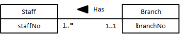
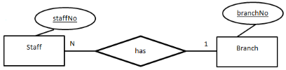
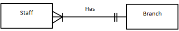

#COMP1121
- Analysis data requirements in a systematic way to help produce a well designed database
## Notations
- UML - Unified Modelling Language

-  Chen's Notation

- Crow's feet notation

## Three major concepts:
### Entities
- Group with same properties that have an independent existence
### Relationships
- 
### Attributes
- A property of a relationship or entity
![[Relational Model#Keys]]