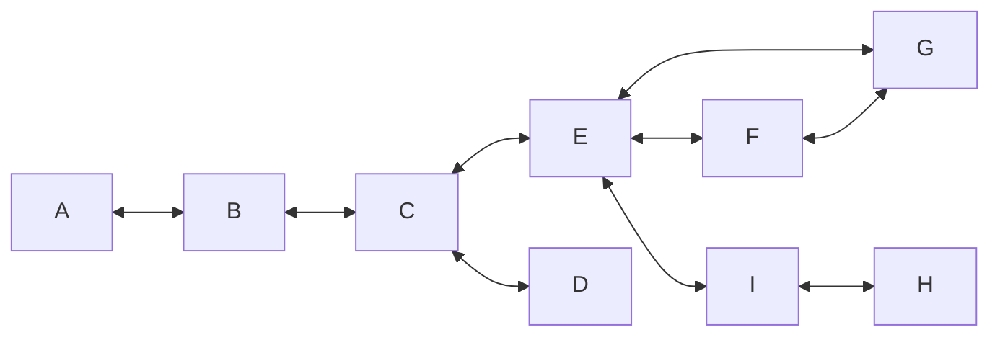

#COMP1511
[K.H.Rosen Discrete Mathematics and it's applications - Chapter 10 / 11](https://docs.google.com/viewer?a=v&pid=sites&srcid=ZGVmYXVsdGRvbWFpbnxzYWVlZG9vbjF8Z3g6N2JmM2Y5YWEzMmRlNWUzNw)
## Basic Graphs
- A simple graph $G=(V(G),E(G))$ with $p$ vertices and $q$ edges consists of a vertex set( or node set) $V(G)= \{v_1, .. v_p\}$ and an edge set $E(G) = \{e_1, ..e_q\}$ 
- each edge is an unordered pair of vertices
- An edge $e = \{uv\}$, is also denoted by $uv$ or $vu$
- The vertices in an edge $e$ are it's endpoints (or endnodes or endvertices) and $e$ is said to connect $u$ and $v$
- An edge is said to be incident to it's endpoints
- Two vertices that are endpoints to the same edge are adjacent vertices
- Two edges that are incident to the same vertex are said to be adjacent edges
- Two adjacent vertices are also called neighbouring vertices

### Multi-graphs
- allow loops (edges joining a vertex to itself)
- allow parallel edges (several edges joining the same two vertices)
### Directed Graphs
- also called digraphs
- edges are ordered pairs of vertices and are called directed edges or arcs
### Weighted Graphs
- each edge is assigned a weight

## Isomorphic Graphs
- Two graphs that have the same structural properties, even if the labels of the vertices and edges differ
- Let $G$ and $H$ be simple graphs. $G$ is isomorphic to $H$, denoted by $G ∼= H$, if there exists a bijection $f : V(G) →V(H)$ such that $uv ∈ E(G)$ if and only if $f(u)f(v) ∈ E(H)$
- Since we will mostly be interested in structural properties of graphs, we will often omit labels when drawing graphs
- An unlabelled graph can be thought of as a representative of an equivalence class of isomorphic graphs
- We assign labels to vertices and edges in a graph for the purpose of referring to them
### Problem
determine in polynomial time whether two graphs are isomorphic. (This is a very difficult problem that is still unsolved).

## Vertex Degree
- Denoted $d_G(v)$ or $d(v)$ or $deg(v)$
- Is the number of edges that are incident to $v$ with loops counted twice
$THEOREM1$ If $G$ is a graph with vertices $V_1, v_2,...v_n$ then $\sum\limits_{i=1}^n d(v_i) = 2|E(G)|$
$Proof:$ Each loop contributes 2 to the summation and each edge $e=uv$ that is not a loop is counted exactly twice, once in $d(u)$ and once in $d(v)$ 
### Friendship puzzle
- Used with the [[Combinatorics#Pigeon hole principle|Pigeon hole principle]]
$Proof:$ Let $G$ be a simple graph with vertex set $V(G) = \{v_1, ...,v_n\}$ denoting the people at the party
- Edges of $G$ are defined as: $uv\in E(G)$ if $u$ and $v$ are friends
- for $i=1,..,n$, $d(v_i)$ number of friends $v_i$
	$CASE1:$ Everyone has at least one friend
	- for every $i=1,..,n,1\leq d(v_i) \leq n-1$
	- Since $n$ variables $d(v_1),...,d(v_n)$ are each assigned one of $n-1$ number from the set $/{1,..,n-1/}$, then at least two must be the same value
	$CASE2:$ Someone does not have any friends
	- For some $i \in \{1,..,n\},d(v_i) \leq n-2$
	- So for every $i=1, ..,n,0 \leq d(v_i) \leq n-2$
	- Since $n$ variables $d(v_i),..,d(v_n)$ are each assigned one of $n-1$ numbers from the set $\{0,..,n-2\}$, at least two of them must have the same value

## Paths and Cycles
>[!warning]
Other Sources will often use different terminology so always check
### Path
Let $v_0$ and $v_n$ be vertices in a graph $G$. A path in $G$ from $v_0$ to $v_n$ of length $n$ is an alternating sequence of $n+1$ vertices and $n$ edges, $v_0e_1v_1e_2 ... v_{n-1}e_nv_n$, in which edge $e_i$ is incident on vertices $v_i−1$ and $v_i$ for every $i = 1,...,n$
- Note that in a simple graph, to denote a path we just need to list the sequence of vertices since two vertices are connected by only one edge, e.g. $v_0v_1 ... v_n$.
- A simple path from vertex $u$ to vertex $v$ in a graph $G$ is a path from $u$ to $v$ with no repeated vertices.
### Cycles
- A cycle in a graph G that includes all of the edges and all of the vertices of G is called an Euler cycle (or an Euler tour, and in the book it is an Euler circuit). A graph is Eulerian if it has an Euler cycle
$THEROEM2$ Euler's Theorem
- A connected graph with at least one edge has an Euler cycle if and only if it has no vertices of odd degree
### Bipartite Graphs
- A graph whose vertices can be partitioned into two (possibly empty) subsets $X$ and $Y$ so that $X \cap Y = \emptyset$ and $X \cup Y = V(G)$ such that each edge of $G$ has one end in $X$ and one in $Y$
- This is called a bipartition of $G$
$THEOREM3$ A graph is a bipartite if and only if it contains no odd simple cycle
- Recognition Algorithm for bipartite graphs:
	Input: A connected graph G
	Output: YES if $G$ is bipartite (together with its bipartation), otherwise NO
		1. For some vertex $u \in V(G)$, search[^1] the graph from $u$. As vertices are discovered partition them into sets $X$ and $Y$ as follows: for $v \in V(G)$, if $v$ is reached on an even path, otherwise place $v$ in $Y$.
		2. Check whether $G$ has an edge $ab$ such that $\{a,b\} \subseteq X$ or $\{a.b\} \subseteq Y$. If no such edge exists return YES and bipartion $(X,Y)$; otherwise return NO

## Trees
- Is a connected graph with no cycles
- A leaf is a vertex of degree 1
- In a connected graph G, an edge e is a cut-edge if the graph obtained from G by removing e is disconnected
$THEOREM4$ for a simple graph $G$ with $n$ vertices $n \leq 1$, the following are equivalent
	1. $G$ is connected and has no cycles
	2. $G$ is connected and has $n-1$ edges
	3. $G$ has $n-1$ edges and no cycles
	4. For every pair $u,v \in V(G)$, $G$ has exactly one simple path from $u$ to $v$

[^1]: graph search - using for example Breadth First Search or Depth First Search algorithms
