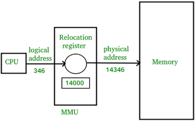

#COMP2211
- Logical Memory: The memory the program sees
- Physical Memory: How memory is actually represented on the disk
## Memory Management Unit

- Logical address: generated by the CPU; also referred to as virtual address
- Physical address: address seen by the memory unit
