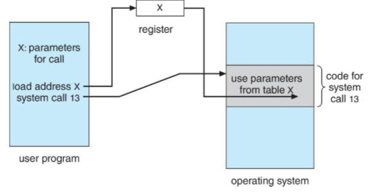

#COMP2211
## Services
- UI
- Program Execution
- I/O operations
- File-system manipulation
- Communications
- Error detection
- Resource allocation
- Logging
- Protection and security

## CLI
- Faster but requires specialised knowledge
- System admins
- Can do more, have special commands not available in GUI
- Easier to do repetitive tasks

## System Calls
- Well defined interface to the services, used by programmers and users
- usually written in C or C++
- e.g. "cp in.txt out.txt"
	- Entering the command, or moving a mouse to select files, causes sequence of I/O system calls.
	- Then, files need to be opened: another set of system calls.
	- Errors need to be detected: input file not existent, output file already exists with the same name.
	- Can ask user if they want to replace the output file—requires set of system calls.
	- When both files are open, we loop by reading bytes from one to another (system calls).
	- Each read must return possible error conditions: end-of-file, hardware failure to read, ...
	- Once done, files should be closed (system calls)
### Parameter Passing
- Three methods to pass parameters
#### Through Registers

#### Tables
- Store in a table and the address is passed through a register
#### Stacks
- Pushed to a stack by a program and popped off the stack by the OS
### Types
System calls can be put into 3 categories
#### Process control
- Running program needs to halt execution.
- If the termination is abnormal, some log files are usually generated.
- Debugger may use those logs to aid programmer in fixing problems.
- Bugs are usually discovered this way in the code.
- When a process is running, it may want to load and execute other programs.
- Create, terminate, duplicate, wait for processes.
- Get information about a process.
- Where data is shared among processes, locking is provided to assure no clashes
#### File management
- Common system calls that deal with files:Create and delete files.
- Open files for reading and writing.
- Similar operations are required for directories.
- Determine and set attributes: file name, type, protection codes, ...
#### Device management
- Processes may need resources to execute: main memory (RAM), disk drives, access to files, ...
- Resources available can be granted, but usually processes will have to wait for them.
- We can think of resources as devices: physical or virtual.
- OS provides systems calls for interacting with these:
	- Request and release a device.
	- Similar to open and close system calls for files.
	- Once we have the device allocated to us, we can read and write.
	- File handling and general devices handling is so similar that UNIX merge the two.
#### Information maintenance
There are system calls for transferring information between OS and user programs:
- Time and date calls.
- Version of OS.
- Amount of free memory or disk space.
- Memory dump also goes into this category.
- Other debugging info usually provided: single step, runtime profiling, program counter recording, various information about processes
#### Communications
Processes need to communicate, and there are two main methods:
###### Message-Passing Process Communication Model
Processes exchange messages with one another to transfer information. Before communication takes places, connection must be opened. Computer host name and process name are used to identify the possibly remote parties for communication. System calls to establish or abort communication are available. Other system calls to receive and send messages are also available.
###### Shared-memory Model
Processes use system calls to create and gain access to regions of memory owned by other processes. Normally, OS prevents process from accessing memory allocated to other processes.In shared-memory model processes have to agree to remove this obstruction
#### Protection
- OS should provide services for protecting computer system resources.
- Traditionally this was to protect one user from another on an instance of some OS.
- With Internet all systems started to get concerned about protection.
- System calls include setting permission on files and disks.
- User allow/deny access systems calls
## [API](API.md) - Application Programming Interface
- APIs hide this away behind a set of standard functions which are made available to programmers, for performing common tasks when developing applications
## Applications being OS specific
- Use interpreted languages like Python, Ruby: interpreter on each system goes through the source code and executes correct instructions and system calls. Interpreter can be limited.
- Use language like Java that runs on Java Virtual Machine (JVM): virtual machine is ported to different systems and programmers use the universal interface of the JVM rather than the specific OS
- Compile code (such as C) for every different configuration
 In general this is still a difficult problem and there is no ultimate solution. Porting is required.