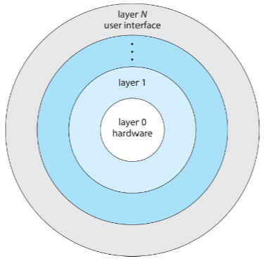

# OS Structure
## Monolithic Kernel
- OG Unix used this approach
- Place all kernel functions into single, static bin file
- Runs in single address space
- Not much / no structure
- Simple concept but difficult to implement and extend
- Have performance advantage, hence still relevant
- **Tightly Coupled:** changes in the system can effect all other parts
## Layered Approach
- **Loosely Coupled:** structured into parts doing specific limited functions
- Highest layer is user interface, while lowest layer is hardware
- Layers can only call functions from the layer below

## Micro-kernel
- Remove all nonessential components from the kernel and implement them as user level programs
- Small kernel
- When OS needs to be extended, new services are added in the user space rather than modifying the kernel.
- Kernel modifications require fewer changes as it is small
- It is also easier to port to another OS and provides more security since most services run in user mode.
- Performance suffers compared to one big kernel - different parts have to communicate
## Booting
- Small piece of code (boot loader / bootstrap program) locates the kernel
- Boot loader is stored in nonvolatile memory
- Kernel is loaded into main memory and started
- Kernel initialises hardware
- Root file system is mounted
- UEFI - modern systems replace BIOS with Unified Extensible Firmware Interface(UEFI)
- BIOS/UEFI perform other tasks:
	- Diagnostics; state of memory and CPU
	- Discovers devices