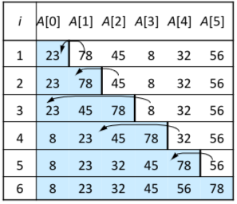

# Insertion Sort
## The Process
1. Split the array into 2 sub arrays; sorted and unsorted
2. Iterate through the unsorted array and an place each value in the sorted array
3. Once the unsorted sub array is empty the array will be sorted

### Pseudo-code
```pseudocode
ALGORITHM insertionSort(A[0..n-1])
//Input: an array A[0..n-1] of n numbers
//Output: array A[0..n-1] in ascending order
for i in A do
	tmp <- A[i]
	j <- 0
	while (j<i and tmp<A[j]) do
		j += 1
	A[j] <- tmp
```
## Analysis
- Faster than [Selection Sort](Selection%20Sort.md) because it will often not have to search the whole sorted array before exiting the loop
- Worst Case is equal to [Selection Sort](Selection%20Sort.md)
- Time Complexity $= O(n^2)$