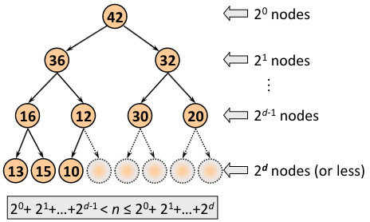

Data structure which has two main operations:
- Insert
- Delete: Removes the element with the largest priority
## Implementations
|  | Unsorted Sequence (array or linked list) | Sorted Sequence (array or linked list) | Heap |
| ---- | ---- | ---- | ---- |
| Inserting  a new element | O(1) | O(n) | O(logn) |
| Deleting the element with the maximum key | O(n) | O(1) | O(logn) |
### Heap
A heap is a complete binary tree down to a depth of d-1 and the nodes of depth d are as far to the left as possible.
The keys are assigned to the nodes in such a way that the key in each node is larger (or no less) than the keys stored at each of its child nodes.
A heap is often called a partially ordered binary tree. It is ordered since each child-parent pair is ordered, but it is not completely ordered since the order of the two children is immaterial (it does not matter whether the largest of two children is in the left or the right sub tree).
#### Properties
- Root of the Heap always contains it's largest element
- The depth $d$ of a heap with $n$ elements is $log_2n$
- The size will get lower in each row but the order within the row is arbitrary

#### Array implementation of a heap
If there are n elements, then we use the first n positions of array A.
- The root element is the element A[0] of the array
- Left child of the node corresponding to A[i] is in A[2i+1]
- Right child of the node corresponding to A[i] is in A[2i+2]
##### Adding a new element
1. Attach a new node with key K after the last leaf of the existing heap
2. Sift K up to its appropriate place in the new heap:
	- Compare K with its parent’s key
	- If the parent’s key is greater than or equal to K, stop
	- Otherwise swap these two keys and repeat Step 2,comparing K with its new parent.