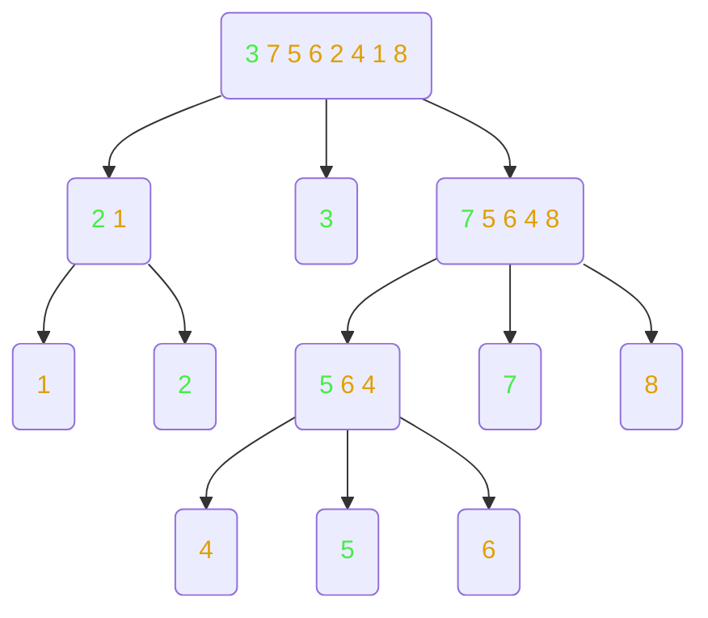

# Quick Sort
#COMP2711 #Sort
## The Process
1. Find pivot (in this case Array[0])
2. Move items < to left array and > to right array. Pivot goes in middle (green)
3. Repeat till all items are in an array length 1
4. If you read from left to right then items will be in order

### Pseudo Code
```
ALGORITHM quickSort(A[0..n-1])
//The algorithm sorts a given array by recursive quick-sort
//Input: an array A[0..n-1] of n numbers
//Output: the array A sorted in ascending order
if n > 1
pivot <- A[0]
copy the elements of A smaller than pivot to S1    //divide
copy the elements of A equal to pivot to S2        //divide
copy the elements of A larger than pivot to S3     //divide quickSort(S1)                                      //recur
quickSort(S3)                                      //recur
copy the elements back into A in order:            //conquer
	- first insert the elements of S1,
	- then those of S2,
	- and finally those of S3.
```
## Analysis
- The structure of the tree of quick-sort depends on the pivot element
- Best Case: 
	- Each pivot elements splits array into 2 of equal size
	- The number of levels of the quick-sort tree is no larger than $log_2n$
	- The total number of comparisons is $nlog_2n$ (similar to merge-sort)
- Worst Case:
	- One sub array is empty and other contains all but the pivot(e.g. if in ascending order)
	- Time Complexity $= O(n^2)$
	- Total Comparisons $= n$
- Average Case:
	- Total Comparisons $= nlog_2n$
	- In practice quick sort is usually quicker than [Merge Sort](Semester3/COMP2711-Algorithms1/Merge%20Sort.md)
	- In place implementation also requires no additional memory
