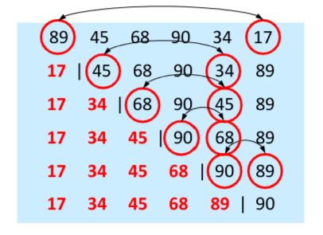

# Selection Sort
## The Process
1. Search the array for the smallest element
2. Swap with the first element
3. Repeat moving along elements through the whole array

### Pseudo code
```pseudocode
ALGORITHM selectionSort(A[0..n-1])
//Input: an array A[0..n-1] of n elements
//Output: array A[0..n-1] in ascending order
for i in A:
	for A[i] to A[n]
		seach array for minimum value A[min]
	swap A[i] and A[min]
```
## Analysis
- The array at any moment is divided into two parts: sorted and unsorted; any element of the sorted sub-array is less than or equal to any element of the unsorted one
- In each pass of the algorithm, the minimum element of the unsorted sub-array is found and swapped with the first element of the unsorted sub-array. The sorted sub-array is thus extended by one element in every pass
- Has O notation $O(n^2)$
