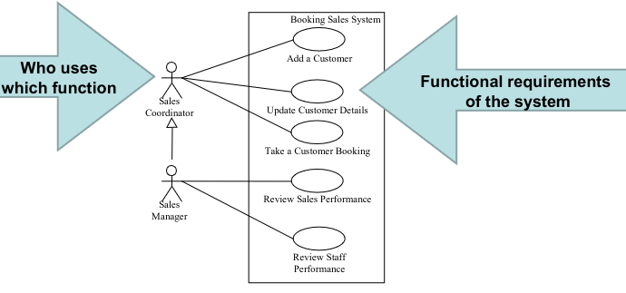

## Use Case Diagrams

**Functional Requirements** - what system should do for users
### Non-Functional Requirements
**Non Functional Requirements** - what design qualities the functions and whole system must have(how well it should do what it does)
#### Use Case
Is a model of a class of transactions between the user and the system of measurable value. Use cases must have a positive value proposal, i.e. Reward > Effort.
#### Usability
Lower connotative effort to perform a task. If a task is enjoyable it can also increase the reward.
- Effectiveness
	- Users find what they want
	- **Use Case** completes seccessfully
- Efficiency
	- Users use minimal resources or effort
	- **Effort** is minimal to increase value proposal
- Satisfaction
	- Users enjoy the experience
	- **Reward** is increased to increase value proposal
##### Learning Curve
- Vary by individual’s aptitude, motivation,intellect, experience, state-of-mind etc.
- Vary by how much the system aids the cognitive learning processes
- Are different for first-timers and experienced users
- First timers have to learn “everything”,experts “know” already
#### Performance
Has a neutral effect, UNLESS is slower than the user's cognitive process. if so it increases effort.
Performance is an emergent property of all computing elements in a system – all of the hardware, networks and software used to support the use case.
Two main issues: 
- Latency – the time lag between user action and computer response
- Reliability – not crashing, free from error, consistent
#### Security
Two main issues: 
- Securing sensitive data from theft or abuse
- Securing the integrity and operation of the system
##### Firewall
Hardware and/ or Software placed between an organisation’s internal network and an external network to prevent outsiders from invading private networks
##### Zoned Security Principle
Different levels of security are appropriate based on:
How much public access is required vs. How valuable are the things we need to secure

| Attack | Defence |
| ---- | ---- |
| Unauthorised Access | Tight Password Management |
| Exploit known weaknesses in programs | Continuously upgrade Systems withpatches and new version. |
| Denial of Service(Overwhelm/ Block the entrance) | Firewall.Monitor, detect and block |
| Trojan Horse Programs | Don’t accept programs from anyone |
| Eavesdropping and Spoofing(Attack the commercial traffic on the road) | EncryptionCertification |
##### Abuse Cases
Ab-use Case (or Mis-use Case) are Use Cases that we want to stop.
The Actor is a “bad actor”. The Abuse case is a case of abusing the system.
Their value proposal is to steal or cause harm. 
To stop them we need to reduce reward and increase effort.
Abuse case modelling is complementary with threat analysis and other cyber security approaches