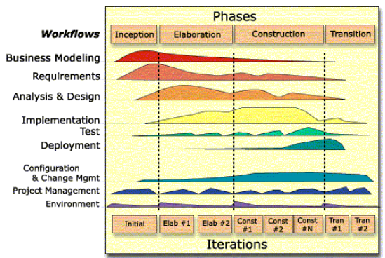

# Software Engineering Definitions
## Software Processes
- [Agile](Semester1/COMP1911-ProfessionalComputing/Agile.md) - Iterative process used to take in feedback over the course of a project 
- Waterfall - Software design process where the previous stage has to be complete before moving on
- Rapid Application Development (RAD)- iterative process where users suggest modifications before further prototypes and the final information system are built
- Dynamic Systems Development Method ([[DSDM]])
- Disciplined Agile Development ([[DAD]])
- [[eXtreme Programming]]
- Unified Process - Repeat the waterfall method quickly over a number of iterations 
- Rational Unified Process - Iterative approach where what each cycle does changes over time

## W
- Non Functional Requirements- what design qualities the functions and whole system must have(how well it should do what it does)
- Encapsulation - no parts of the system should be dependent of the internal workings of another part
- Modularity - The property of a system that has been decomposed into a set of cohesive and loosely coupled modules
- 
- Project Failure - a project that has been cancelled or a project that does not meet its budget, delivery, and business objectives
- Project success - a project that meets its budget, delivery, and business objectives. Also take quality into account